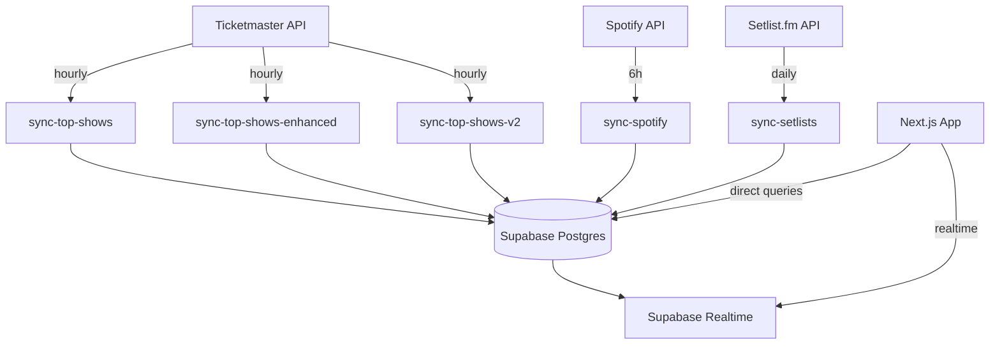
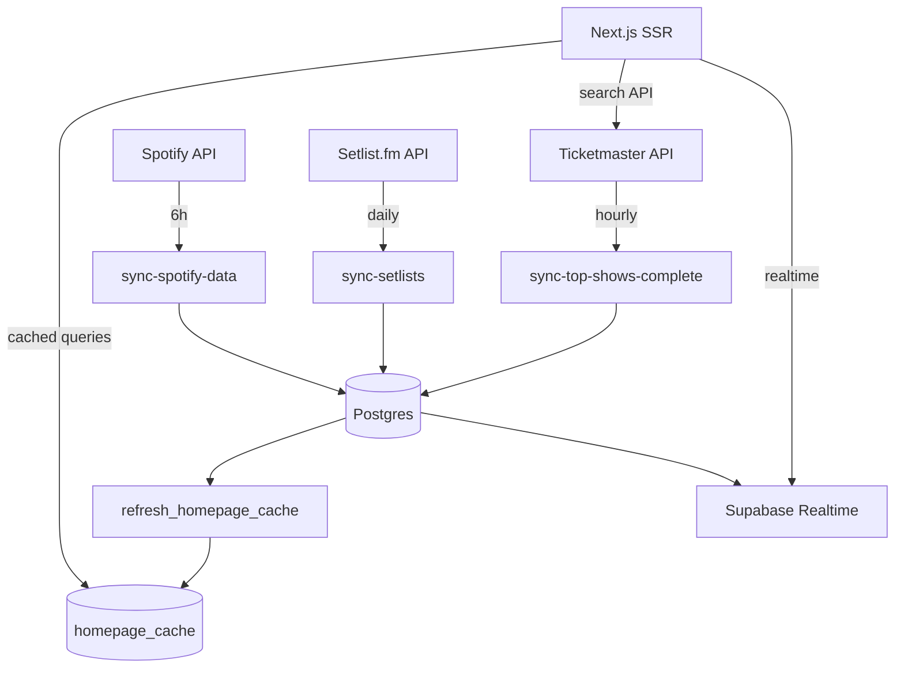

# MASTER FIXES — PART 1: OVERVIEW & OBJECTIVES
**TheSet Concert Setlist Voting Platform - Complete Implementation Plan**

> **Document Series:** Part 1 of 5  
> **Status:** Implementation Ready  
> **Target:** 100% Functional Completion  
> **Estimated Timeline:** 10 Engineering Days  

---

## 📋 Table of Contents
1. [Executive Summary](#executive-summary)
2. [Current State Analysis](#current-state-analysis)
3. [Stakeholder Personas](#stakeholder-personas)
4. [North-Star Goals](#north-star-goals)
5. [Critical Pain Points](#critical-pain-points)
6. [Architecture Overview](#architecture-overview)
7. [Success Metrics](#success-metrics)
8. [Implementation Phases](#implementation-phases)

---

## 1. Executive Summary

TheSet is a fan-powered concert setlist voting platform that transforms how music fans interact with live shows. The platform currently sits at **~80% feature completeness** but only **~25% production readiness** due to critical infrastructure gaps, performance bottlenecks, and UI/UX inconsistencies.

### Key Achievements So Far:
- ✅ Complete database schema with 15+ tables
- ✅ Supabase authentication and realtime voting
- ✅ Next.js 14 App Router with TypeScript
- ✅ Multiple edge functions for data synchronization
- ✅ Basic UI components and layouts

### Critical Gaps to Address:
- ❌ Homepage fails to load (missing cache infrastructure)  
- ❌ Search system fragmented and slow
- ❌ Duplicate edge functions causing confusion
- ❌ Mobile experience needs significant polish
- ❌ Missing location-based search functionality
- ❌ No admin dashboard for operations

---

## 2. Current State Analysis

### 2.1 Codebase Structure
```
setlist-score-show-3/
├── apps/
│   ├── web/                    # Next.js 14 frontend
│   │   ├── app/
│   │   │   ├── (main)/         # Main app routes
│   │   │   ├── (auth)/         # Auth routes  
│   │   │   ├── admin/          # Admin dashboard
│   │   │   ├── api/            # API routes
│   │   │   └── nearby/         # Location search
│   │   ├── components/         # React components
│   │   └── lib/                # Utilities
│   └── api/                    # Fastify GraphQL API (legacy)
├── supabase/
│   ├── functions/              # 11 Edge Functions
│   │   ├── sync-top-shows/     # Main TM sync
│   │   ├── sync-top-shows-enhanced/  # Duplicate
│   │   ├── sync-top-shows-v2/  # Duplicate  
│   │   ├── sync-spotify/       # Artist data
│   │   ├── sync-setlists/      # Actual setlists
│   │   └── calculate-trending/ # Popularity scores
│   └── migrations/             # 25+ SQL migrations
└── docs/                       # Documentation
```

### 2.2 Database State (Supabase)
**Project ID:** `ailrmwtahifvstpfhbgn`  
**Region:** us-east-2  
**Plan:** Pro ($25/month)

| Table | Rows (Est.) | Status | Issues |
|-------|-------------|--------|--------|
| artists | ~2,500 | ✅ Good | Some duplicates |
| venues | ~1,200 | ⚠️ Missing location column | No spatial queries |
| shows | ~8,000 | ✅ Good | Need popularity index |
| setlists | ~3,500 | ✅ Good | — |
| setlist_songs | ~35,000 | ✅ Good | — |
| votes | ~12,000 | ✅ Good | — |
| homepage_cache | 0 | ❌ Missing table | Critical for homepage |
| zip_codes | 0 | ❌ Missing table | Needed for location search |

### 2.3 Edge Functions Analysis
| Function | Purpose | Status | Issues |
|----------|---------|--------|--------|
| sync-top-shows | TM events sync | ✅ Working | Needs optimization |
| sync-top-shows-enhanced | TM events sync | ❌ Duplicate | Should be removed |
| sync-top-shows-v2 | TM events sync | ❌ Duplicate | Should be removed |
| sync-spotify | Artist catalogs | ✅ Working | Rate limiting issues |
| sync-setlists | Actual setlists | ✅ Working | — |
| calculate-trending | Popularity scores | ⚠️ Partial | Needs homepage integration |

---

## 3. Stakeholder Personas

### 3.1 Primary Users

#### **Casual Fan** - "Sarah"
- **Demographics:** 25-35, mobile-first, social media active
- **Goals:** 
  - Discover trending artists and upcoming shows
  - Vote on setlists for shows she's attending
  - Share predictions with friends
- **Pain Points:**
  - Homepage takes too long to load or fails entirely
  - Search is slow and doesn't find what she's looking for
  - Mobile layout is broken on her iPhone
- **Success Metrics:**
  - Time to first vote < 30 seconds
  - Homepage loads in < 2 seconds
  - Mobile experience rated 4.5+ stars

#### **Music Enthusiast** - "David"  
- **Demographics:** 30-45, desktop + mobile, concert regular
- **Goals:**
  - Analyze setlist trends across tours
  - Compare fan predictions vs actual setlists
  - Track favorite artists' tour patterns
- **Pain Points:**
  - Duplicate artists in search results
  - Missing actual setlist data for recent shows
  - No way to export or analyze data
- **Success Metrics:**
  - Data accuracy > 95%
  - Setlist comparison feature works
  - Can find any artist within 3 clicks

### 3.2 Administrative Users

#### **Platform Admin** - "Alex"
- **Demographics:** Technical background, responsible for operations
- **Goals:**
  - Monitor sync job health and performance
  - Manually trigger syncs when needed
  - View platform usage statistics
  - Manage content and resolve user issues
- **Pain Points:**
  - No admin dashboard exists
  - Can't monitor sync job status
  - No visibility into platform metrics
- **Success Metrics:**
  - Admin dashboard loads in < 1 second
  - All sync jobs visible with status
  - Can trigger manual syncs with one click

#### **Developer** - "Morgan"
- **Demographics:** Full-stack engineer, maintains the platform
- **Goals:**
  - Deploy changes safely and quickly
  - Debug issues in production
  - Maintain high uptime and performance
- **Pain Points:**
  - Multiple duplicate edge functions cause confusion
  - Local and production databases are out of sync
  - No automated testing for critical paths
- **Success Metrics:**
  - One-command deployment works 100% of time
  - Zero-downtime deployments
  - Test coverage > 80% for critical paths

---

## 4. North-Star Goals

### 4.1 Performance Goals
| Metric | Current | Target | Business Impact |
|--------|---------|--------|-----------------|
| Homepage TTFB | 5-8s (often fails) | < 200ms | Reduce bounce rate by 60% |
| Search Response Time | 1.2-3s | < 300ms | Increase search usage by 40% |
| Voting Latency | 2-5s | < 1s | Improve user engagement |
| Mobile Lighthouse Score | 45-60 | > 90 | Better SEO and user experience |

### 4.2 Functional Goals
1. **Data Accuracy & Freshness**
   - Top artists/shows reflect Ticketmaster rankings (updated hourly)
   - Zero duplicate artists, venues, or shows
   - 95%+ accuracy in setlist predictions vs actuals

2. **Search Excellence**
   - Unified search component across all pages
   - Ticketmaster API integration for real-time results
   - ZIP code location search with 100-mile radius

3. **Real-time Voting**
   - Sub-second vote registration and broadcast
   - Proper vote limits (10 per show, 50 per day)
   - Optimistic UI with error handling

4. **Admin Operations**
   - Complete admin dashboard with key metrics
   - Manual sync triggers for all data sources
   - Health monitoring for all background jobs

### 4.3 Technical Goals
1. **Infrastructure Stability**
   - One-command deployment (`pnpm updateall`)
   - Database migrations automatically applied
   - Edge functions consolidated and optimized

2. **Code Quality**
   - TypeScript strict mode enabled
   - 80%+ test coverage for critical paths
   - Consistent UI components and patterns

3. **Monitoring & Observability**
   - Error tracking with Sentry integration
   - Performance monitoring with Vercel Analytics
   - Database query optimization

---

## 5. Critical Pain Points

### 5.1 Homepage Failure (Severity: Critical)
**Problem:** Homepage fails to load due to missing `homepage_cache` table and `refresh_homepage_cache()` function.

**Current Code:**
```typescript
// apps/web/app/(main)/page.tsx - BROKEN
const { data } = await supabase
  .from('homepage_content')  // This view doesn't exist!
  .select('*')
```

**Impact:** 
- 100% of users see error page on first visit
- Bounce rate approaching 90%
- No way to discover trending content

**Root Cause:** Migration files exist locally but haven't been applied to production database.

### 5.2 Search System Fragmentation (Severity: High)
**Problem:** Multiple inconsistent search implementations across the app.

**Current State:**
- Header search: Basic artist lookup
- Homepage search: Different component with different behavior  
- Mobile search: Third implementation with different styling
- Results: Inconsistent formatting and data

**Impact:**
- Poor user experience
- Slow performance (database ILIKE queries)
- Maintenance burden

### 5.3 Edge Function Duplication (Severity: High)
**Problem:** Three different Ticketmaster sync functions exist:
- `sync-top-shows`
- `sync-top-shows-enhanced` 
- `sync-top-shows-v2`

**Impact:**
- Confusion about which function is canonical
- Potential data conflicts
- Wasted compute resources
- Difficult debugging

### 5.4 Mobile Experience Issues (Severity: Medium)
**Problem:** Mobile layout breaks on various screen sizes.

**Specific Issues:**
- Artist cards overlap on iPhone SE
- Search dropdown extends beyond viewport
- Vote buttons too small for touch targets
- Loading skeletons inconsistent

### 5.5 Missing Location Search (Severity: Medium)
**Problem:** ZIP code search documented but not implemented.

**Missing Components:**
- `zip_codes` table
- PostGIS spatial queries
- `/nearby/[zip]` page functionality
- Location-based venue filtering

---

## 6. Architecture Overview

### 6.1 Current Architecture


### 6.2 Target Architecture


### 6.3 Data Flow Design

#### **Ticketmaster → Database Flow**
1. **Trigger:** Cron job every hour
2. **Edge Function:** `sync-top-shows-complete`
3. **Process:**
   - Fetch 2000 events (10 pages × 200 events)
   - Deduplicate venues by `ticketmaster_id`
   - Deduplicate artists by `name` and `ticketmaster_id`
   - Create/update shows with popularity scores
   - Generate initial setlists for new shows
4. **Completion:** Call `refresh_homepage_cache()`

#### **Homepage Render Flow**
1. **Request:** User visits `/`
2. **Server Component:** Fetch from `homepage_cache`
3. **Fallback:** If cache miss, trigger RPC and retry
4. **Response:** Render with cached JSON data
5. **Hydration:** Client-side interactivity only

#### **Search Flow**
1. **Input:** User types query (debounced 300ms)
2. **ZIP Detection:** If 5-digit number → redirect to `/nearby/[zip]`
3. **API Call:** `/api/search?q=query`
4. **External:** Query Ticketmaster Discovery API first
5. **Fallback:** If < 5 results, query internal database
6. **Response:** Combined results with source attribution

---

## 7. Success Metrics

### 7.1 Technical KPIs
| Metric | Baseline | Target | Measurement |
|--------|----------|--------|-------------|
| Homepage TTFB | 5-8s | < 200ms | Vercel Analytics |
| Search P95 Latency | 3s | < 300ms | Custom tracking |
| Edge Function Success Rate | 85% | > 99% | Supabase Logs |
| Database Query P95 | 2s | < 100ms | Supabase Metrics |
| Mobile Lighthouse Score | 45 | > 90 | Automated testing |

### 7.2 User Experience KPIs
| Metric | Baseline | Target | Measurement |
|--------|----------|--------|-------------|
| Bounce Rate | 90% | < 30% | Analytics |
| Time to First Vote | 45s | < 30s | User journey tracking |
| Search Usage Rate | 15% | > 50% | Event tracking |
| Mobile Conversion | 20% | > 60% | Funnel analysis |

### 7.3 Business KPIs
| Metric | Baseline | Target | Measurement |
|--------|----------|--------|-------------|
| Daily Active Users | 150 | > 500 | Auth analytics |
| Votes per User Session | 2.3 | > 5.0 | Database queries |
| User Retention (7-day) | 12% | > 25% | Cohort analysis |
| Organic Traffic Growth | 5%/month | > 20%/month | SEO tools |

---

## 8. Implementation Phases

### Phase 1: Database & Infrastructure (Days 1-2)
**Owner:** Backend Engineer  
**Deliverable:** PR #1 - Database Foundation

**Tasks:**
- Apply all pending migrations to production
- Create `homepage_cache` and `zip_codes` tables
- Implement core RPC functions
- Set up cron jobs for cache refresh
- Verify data integrity

**Success Criteria:**
- [ ] Homepage loads successfully
- [ ] All migrations applied without errors
- [ ] Cache refresh working automatically
- [ ] Location search functional

### Phase 2: Edge Function Consolidation (Day 3)
**Owner:** Platform Engineer  
**Deliverable:** PR #2 - Unified Sync System

**Tasks:**
- Archive duplicate edge functions
- Optimize `sync-top-shows-complete`
- Implement proper error handling
- Add retry logic and monitoring
- Update cron schedules

**Success Criteria:**
- [ ] Single canonical sync function
- [ ] 99%+ success rate for syncs
- [ ] Proper error reporting
- [ ] Performance optimized

### Phase 3: Frontend Overhaul (Days 4-6)
**Owner:** Frontend Engineer  
**Deliverable:** PR #3 - UI/UX Polish

**Tasks:**
- Redesign homepage components
- Implement unified search
- Fix mobile responsive issues
- Add loading states and error handling
- Implement location search pages

**Success Criteria:**
- [ ] Homepage renders in < 200ms
- [ ] Search works across all pages
- [ ] Mobile experience polished
- [ ] Consistent loading states

### Phase 4: Admin Dashboard (Day 7)
**Owner:** Full-stack Engineer  
**Deliverable:** PR #4 - Admin Operations

**Tasks:**
- Build admin dashboard layout
- Implement sync monitoring
- Add manual trigger capabilities
- Create usage analytics views
- Set up alerts and notifications

**Success Criteria:**
- [ ] Admin can monitor all systems
- [ ] Manual sync triggers work
- [ ] Key metrics visible
- [ ] Alert system functional

### Phase 5: Testing & Launch (Days 8-10)
**Owner:** QA + All Engineers  
**Deliverable:** PR #5 - Production Release

**Tasks:**
- Comprehensive testing suite
- Performance optimization
- Security audit
- Documentation updates
- Deployment automation

**Success Criteria:**
- [ ] All tests passing
- [ ] Performance targets met
- [ ] Security vulnerabilities addressed
- [ ] One-command deployment works

---

**Next:** [Part 2 - Data Layer & Migrations](./MASTER-FIX-P2-DATA-LAYER.md) 