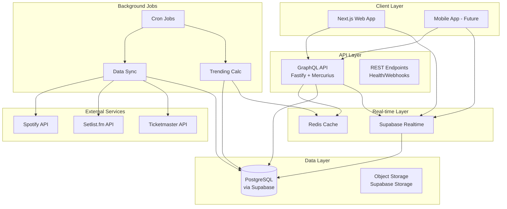

# Setlist Score Show - Architecture Overview

## System Architecture

## Key Components

### 1. Web Application (Next.js 14)
- **Technology**: Next.js 14 with App Router
- **Purpose**: User-facing web application
- **Features**:
  - Server-side rendering for SEO
  - Real-time voting interface
  - Artist and show discovery
  - User profiles and history

### 2. API Server (Fastify + GraphQL)
- **Technology**: Fastify with Mercurius GraphQL
- **Purpose**: Business logic and data orchestration
- **Features**:
  - GraphQL API for flexible queries
  - Authentication via Supabase Auth
  - Rate limiting and caching
  - WebSocket subscriptions for real-time updates

### 3. Database (PostgreSQL via Supabase)
- **Technology**: PostgreSQL 15
- **Purpose**: Primary data storage
- **Features**:
  - Row-level security (RLS)
  - Full-text search with pg_trgm
  - Materialized views for performance
  - Automatic replication and backups

### 4. Real-time Updates (Supabase Realtime)
- **Technology**: Supabase Realtime (PostgreSQL logical replication)
- **Purpose**: Live voting updates and presence
- **Features**:
  - Database change broadcasts
  - Presence tracking
  - Custom event channels
  - Automatic reconnection

### 5. Caching Layer (Redis)
- **Technology**: Redis 7
- **Purpose**: Performance optimization
- **Features**:
  - Query result caching
  - Session storage
  - Rate limiting counters
  - Real-time metrics

### 6. Background Jobs
- **Technology**: Node.js with cron scheduling
- **Purpose**: Data synchronization and calculations
- **Jobs**:
  - Setlist.fm sync (daily)
  - Spotify catalog updates
  - Trending score calculations
  - Ticketmaster show imports

## Data Flow

### Voting Flow
1. User clicks vote button in web app
2. GraphQL mutation sent to API
3. API validates vote limits and permissions
4. Vote recorded in PostgreSQL transaction
5. Cache invalidated in Redis
6. Real-time update broadcast via Supabase
7. All connected clients receive update
8. UI updates optimistically

### Data Sync Flow
1. Cron job triggers sync process
2. External API data fetched with rate limiting
3. Data normalized and validated
4. Upserted into PostgreSQL
5. Cache warmed with new data
6. Trending scores recalculated
7. Materialized views refreshed

## Security Architecture

### Authentication & Authorization
- **Supabase Auth**: JWT-based authentication
- **Row Level Security**: Database-level access control
- **API Authorization**: GraphQL field-level permissions
- **Rate Limiting**: Per-user and per-IP limits

### Data Protection
- **Encryption**: TLS for all connections
- **Secrets Management**: Environment variables via Vercel/Railway
- **Input Validation**: Zod schemas for all inputs
- **SQL Injection Prevention**: Parameterized queries via Prisma

## Scaling Strategy

### Horizontal Scaling
- **Web**: Vercel Edge Network (automatic)
- **API**: Railway/Fly.io with auto-scaling
- **Database**: Supabase managed scaling
- **Cache**: Redis Cluster (if needed)

### Performance Optimizations
- **Database Indexes**: Covering indexes for common queries
- **Materialized Views**: Pre-computed trending data
- **Query Optimization**: N+1 prevention with DataLoader
- **CDN**: Static assets via Vercel CDN
- **Image Optimization**: Next.js Image component

## Monitoring & Observability

### Application Monitoring
- **Error Tracking**: Sentry integration
- **Performance**: Vercel Analytics
- **Uptime**: Better Uptime or Pingdom
- **Logs**: Structured logging with Pino

### Infrastructure Monitoring
- **Database**: Supabase dashboard
- **API Metrics**: Prometheus + Grafana
- **Real-time Stats**: Custom Redis metrics
- **Alerts**: PagerDuty integration

## Deployment Architecture

### Environments
- **Development**: Local Docker Compose
- **Staging**: Preview deployments on Vercel/Railway
- **Production**: 
  - Web: Vercel
  - API: Railway or Fly.io
  - Database: Supabase
  - Redis: Upstash or Railway

### CI/CD Pipeline
1. Code pushed to GitHub
2. GitHub Actions run tests
3. Preview deployment created
4. Manual approval for production
5. Zero-downtime deployment
6. Automatic rollback on failure

## Technology Decisions

### Why Next.js 14?
- Built-in optimization features
- Excellent developer experience
- Strong ecosystem support
- Server Components for performance

### Why Fastify + GraphQL?
- High performance Node.js framework
- GraphQL for flexible data fetching
- Strong TypeScript support
- Easy WebSocket integration

### Why Supabase?
- Managed PostgreSQL with extras
- Built-in authentication
- Real-time subscriptions
- Row-level security
- Generous free tier

### Why Monorepo?
- Code sharing between apps
- Unified versioning
- Easier refactoring
- Better developer experience

## Future Considerations

### Mobile Application
- React Native with Expo
- Share business logic via packages
- Offline-first architecture
- Push notifications

### Machine Learning
- Song recommendation engine
- Voting prediction models
- Anomaly detection for fraud
- Personalized show recommendations

### International Expansion
- Multi-region deployment
- Internationalization (i18n)
- Local payment providers
- GDPR compliance

### Advanced Features
- Artist dashboard
- Venue partnerships
- Ticket integration
- Social features